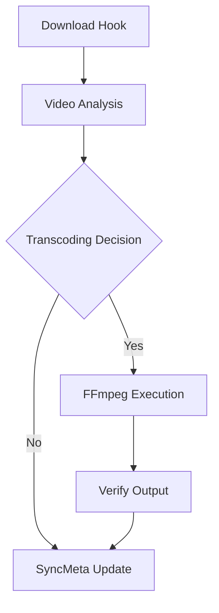

# Video Transcoder Addon Architecture

This document serves as the comprehensive architectural reference for the Video Transcoder addon for USDB Syncer. It consolidates key design decisions, component architectures, and technical implementation details for core transcoding, batch operations, backup management, and hardware acceleration.

## 1. Introduction

The Video Transcoder addon is designed to automatically convert downloaded video files into your configured target format. Default presets target Unity-friendly formats (H.264/VP8/HEVC with yuv420p). Advanced configuration allows non-Unity formats like VP9/AV1.

High-level flow

### Key Objectives
- **Compatibility**: Support Unity-compatible output formats (H.264, VP8, HEVC) while also supporting additional codecs (VP9, AV1) for non-Unity workflows.
- **Performance**: Leverage hardware acceleration (Intel QuickSync) for efficient transcoding.
- **Data Integrity**: Maintain synchronization with USDB Syncer's metadata and song files.
- **Safety**: Provide robust backup, rollback, and abort mechanisms to prevent data loss.

---

## 2. Core Transcoding Engine

The core engine is responsible for analyzing video files, determining if transcoding is necessary, and executing FFmpeg commands.

### 2.1 Video Analysis ([`video_analyzer.py`](../video_analyzer.py))
Uses `ffprobe` to extract technical metadata (codec, resolution, FPS, pixel format, etc.).
- **Decision Logic**: A video is transcoded if it doesn't match the target codec's requirements (e.g., H.264 must be `yuv420p` and use compatible profiles like `baseline`, `main`, or `high`).
- **Strict Matching**: Transcoding is skipped only if the source matches the configured target codec and the relevant checked settings. This can be used for Unity-friendly output, but it can also enforce non-Unity formats when configured.

### 2.2 Transcoding Process ([`transcoder.py`](../transcoder.py))
- **Atomic Replacement**: Transcoding is performed to a temporary `.transcoding` file. Only upon success is the original file replaced.
- **Audio Handling**: Audio is copied (`-c:a copy`) if compatible with the target container; otherwise, it is re-encoded (e.g., to AAC for MP4).
- **Verification**: Optional post-transcode analysis ensures the output file is valid and matches expectations.

### 2.3 Codec Handler Registry ([`codecs.py`](../codecs.py))
Uses a registry pattern to support multiple output formats (H.264, VP8, HEVC, VP9, AV1).
- **Extensibility**: New codecs can be added by implementing the `CodecHandler` interface and registering them.
- **Agnostic Design**: Handlers build FFmpeg commands based on provided hardware accelerator capabilities without being hard-coded to specific APIs.

---

## 3. Hardware Acceleration ([`hwaccel.py`](../hwaccel.py))

The addon features a simplified, global hardware acceleration architecture.

### 3.1 Accelerator Registry
The architecture supports multiple backends through a common interface.

Current implementation status
- **Implemented**: Intel QuickSync (QSV) on Windows/Linux
- **Planned (future work)**: NVENC (NVIDIA), VideoToolbox (macOS), and VAAPI (Linux)

### 3.2 Automatic Selection
- **Global Toggles**: Users enable/disable hardware encoding and decoding globally.
- **Best Fit**: The system automatically selects the best available accelerator for the target codec.
- **Independent Pipeline**: Hardware encoding and decoding are independent. However, hardware decoding is automatically disabled when video filters (scaling, FPS capping) are active to ensure pipeline stability.

Note: In practice, hardware decoding is auto-disabled when hardware encoding is enabled and resolution/FPS filters are requested, to avoid decoder/encoder compatibility issues.

---

## 4. Batch Transcoding System

The batch system allows library-wide transcoding with a sophisticated GUI and safety features.

### 4.1 Orchestration ([`batch_orchestrator.py`](../batch_orchestrator.py))
Coordinates the multi-phase workflow:
1. **Preview**: Scans the library and estimates disk space, time, and output sizes.
2. **Selection**: Interactive dialog ([`batch_preview_dialog.py`](../batch_preview_dialog.py)) for filtering and choosing candidates.
3. **Execution**: Background processing via [`BatchWorker`](../batch_worker.py) with real-time progress updates.
4. **Results**: Comprehensive summary and detailed logs ([`batch_results_dialog.py`](../batch_results_dialog.py)).

### 4.2 Immediate Abort Mechanism
- **`BatchAbortRegistry`**: A thread-safe singleton that propagates abort signals from the UI to the active FFmpeg process.
- **Best-effort Termination**: FFmpeg termination is best-effort; usually responds quickly but can be delayed if the process isn't producing output. The system attempts graceful termination first and then force-kills if needed.

---

## 5. Backup and Rollback Systems

Safety is prioritized through two distinct mechanisms: persistent user backups and temporary batch rollbacks.

### 5.1 Persistent User Backups ([`backup_manager.py`](../backup_manager.py))
- **Purpose**: Long-term preservation of original source files.
- **Mechanism**: Original files are renamed with a suffix (default `-source`) and tracked in SyncMeta.
- **Management**: A dedicated GUI allows users to scan for and safely delete these backups to reclaim space.

### 5.2 Batch Rollback System ([`rollback.py`](../rollback.py))
- **Purpose**: Revert changes if a batch operation is aborted by the user.
- **Mechanism**: Copies original videos to a unique system temporary directory *before* transcoding.
- **Manifest**: Tracks all changes in a JSON manifest for reliable restoration.
- **Cleanup**: Temporary backups are deleted after a successful batch or after a successful rollback.

Rollback trigger behavior
- Rollback is offered only when the user aborts a batch operation
- Individual transcode failures do not trigger rollback. Failed items are marked as failed and the batch continues

### 5.3 Backup Preservation Rule
After a successful batch transcode, if a user backup already exists, it is updated to the *pre-transcode* version. This ensures backups remain exactly one revision behind the active video, acting as a rolling checkpoint.

---

## 6. Sync Tracking Integration ([`sync_meta_updater.py`](../sync_meta_updater.py))

**CRITICAL**: USDB Syncer uses mtime-based synchronization. To prevent infinite re-download loops, the addon MUST update SyncMeta correctly.

### Post-Transcode Workflow
1. **Preserve Resource ID**: The original remote resource identifier must be kept.
2. **Update Filename & mtime**: SyncMeta must point to the new filename and its exact mtime (in microseconds).
3. **Update #VIDEO Tag**: The song's `.txt` file header must be updated to reference the new transcoded filename.
4. **Custom Data**: Transcoding metadata (codec, timestamp, source filename) is stored in `SyncMeta.custom_data`.

---

## 7. Testing and Validation

Planned testing coverage includes:
- **P0**: Core functionality, SyncMeta integrity, and hardware acceleration.
- **P1**: Error handling (timeouts, permissions, corruption) and rollback robustness.
- **P2**: Performance characterization at full library scale (1000+ videos).
