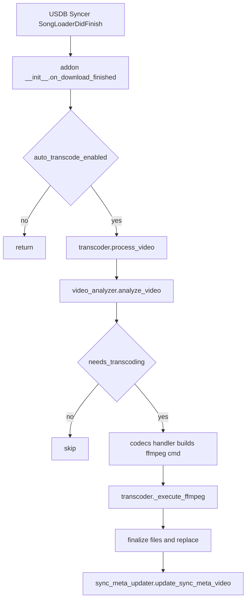
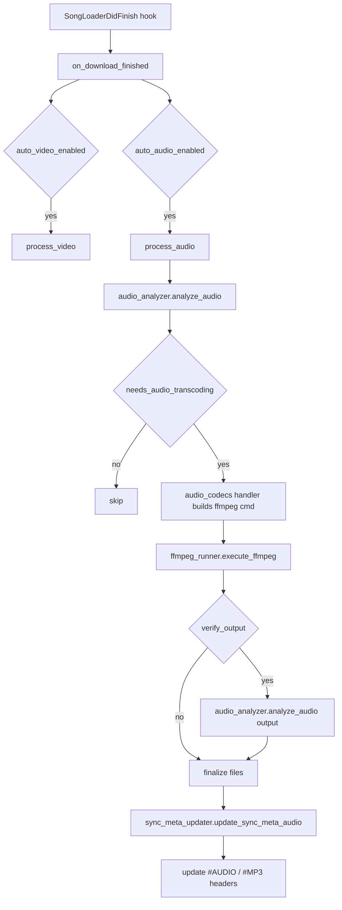
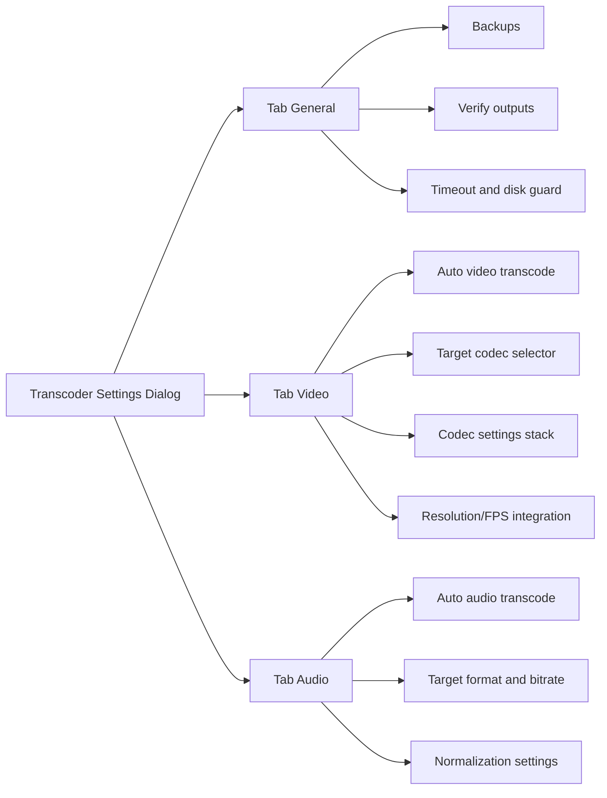

# Transcoder Addon Expansion Architecture (Video + Audio)

This document originally proposed an architectural plan to expand the existing **Transcoder** addon into a complete **Audio + Video Transcoder** addon for USDB Syncer.

Status

- The expansion is now implemented.
- Treat this as historical/background context.
- For the canonical, current architecture reference, see [`docs/ARCHITECTURE.md`](ARCHITECTURE.md).

Scope decision (implemented behavior)
- Audio transcoding applies to **standalone audio files referenced by SyncMeta audio** (e.g. `.m4a`, `.mp3`, `.ogg`, `.opus`) **after download**.
- The addon does not “replace the audio track inside video files” as a separate audio pipeline. Video transcoding may copy or re-encode the video’s embedded audio stream as part of video output generation.

Key references in the current addon
- Addon entrypoint + hook registration: [`__init__.py`](../__init__.py:1)
- Core video pipeline: [`transcoder.process_video()`](../transcoder.py:41)
- Codec registry + ffmpeg command builders: [`codecs.py`](../codecs.py)
- Video analysis + decision logic: [`video_analyzer.needs_transcoding()`](../video_analyzer.py:232)
- SyncMeta update for video: [`update_sync_meta_video()`](../sync_meta_updater.py:25)
- Current GUI: [`TranscoderSettingsDialog`](../settings_gui.py:33)

Key references in USDB Syncer (base project)
- Download audio format + bitrate + normalization settings:
  - [`AudioFormat`](../../usdb_syncer/src/usdb_syncer/settings.py:352)
  - [`AudioBitrate`](../../usdb_syncer/src/usdb_syncer/settings.py:404)
  - [`AudioNormalization`](../../usdb_syncer/src/usdb_syncer/settings.py:423)
- USDB Syncer audio normalization implementation:
  - [`normalize_audio()`](../../usdb_syncer/src/usdb_syncer/postprocessing.py:32)
  - Defaults: [`DEFAULT_TARGET_LEVEL_RG_DB`](../../usdb_syncer/src/usdb_syncer/postprocessing.py:25), [`DEFAULT_TARGET_LEVEL_R128_DB`](../../usdb_syncer/src/usdb_syncer/postprocessing.py:26)

---

## 1) Current addon architecture (baseline)

### Baseline (prior to audio support): video-only runtime flow

The addon subscribes to `SongLoaderDidFinish` and, after each download, calls the video pipeline:
- Hook: [`hooks.SongLoaderDidFinish.subscribe()`](../__init__.py:71)
- Processing: [`transcoder.process_video()`](../transcoder.py:41)

A simplified flow:

### Architectural extension principle

Audio transcoding should reuse the same proven invariants of the video pipeline:
- conservative temp-file write + atomic replace
- optional persistent backup behavior
- verify output option (but adapted to audio)
- **SyncMeta correctness**: update filename and microsecond `mtime`, preserve resource ID

---

## 2) Audio codec support (recommendations)

### 2.1 What USDB Syncer supports today

USDB Syncer’s download settings expose these audio formats:
- `m4a` (AAC in MP4 container)
- `mp3` (MPEG audio)
- `ogg` (Ogg Vorbis)
- `opus` (Ogg Opus)

Source: [`AudioFormat`](../../usdb_syncer/src/usdb_syncer/settings.py:352)

USDB Syncer also defines target bitrates (used during download postprocessing and normalization):
- 128 / 160 / 192 / 256 / 320 kbps

Source: [`AudioBitrate`](../../usdb_syncer/src/usdb_syncer/settings.py:404)

### 2.2 Proposed transcoder support matrix

Design goals
- **At minimum**, support the same outputs as USDB Syncer downloads: **m4a, mp3, ogg(vorbis), opus**.
- Accept “anything ffmpeg can decode” as input, but define a **supported/guaranteed input set** for predictable behavior.

Recommended approach
- **Outputs (guaranteed)**:
  - M4A (AAC-LC) in MP4 container
  - MP3 (LAME)
  - OGG (Vorbis)
  - OPUS (Opus in Ogg)
- **Inputs (best-effort)**:
  - Anything ffmpeg can decode (AAC/MP3/Vorbis/Opus/ALAC/FLAC/WAV, plus audio extracted from containers)
  - The addon should detect “not decodable / not audio” early with ffprobe.

#### 2.2.1 Explicit input/output matrix (v1)

The table below defines what is *guaranteed* for v1 behavior (beyond “ffmpeg might decode it”).

| Output setting | Output container | Output codec | Guaranteed input set | Notes |
|---|---|---|---|---|
| m4a | .m4a | AAC-LC (`aac`) | m4a/aac, mp3, ogg/vorbis, opus, wav, flac | Highest compatibility with typical karaoke tooling; matches USDB Syncer default |
| mp3 | .mp3 | MP3 (`libmp3lame`) | m4a/aac, mp3, ogg/vorbis, opus, wav, flac | Useful for very old players; lossy-to-lossy transcodes are expected |
| ogg | .ogg | Vorbis (`libvorbis`) | m4a/aac, mp3, ogg/vorbis, opus, wav, flac | Open format; some players have weaker support |
| opus | .opus | Opus (`libopus`) | m4a/aac, mp3, ogg/vorbis, opus, wav, flac | Very efficient; may require newer decoder support |

Rationale
- The guaranteed input set is centered on common download formats and common lossless intermediates.
- Additional inputs (ALAC, etc.) are “best-effort”; the analyzer can still accept them, but we don’t promise identical behavior across ffmpeg builds.

Rationale
- These 4 outputs exactly match USDB Syncer’s user-facing options, which minimizes user confusion and avoids “two competing audio settings systems”.
- Using ffmpeg encoders (`aac`, `libmp3lame`, `libvorbis`, `libopus`) is portable across platforms.

### 2.3 Containers and stream constraints

Constraints to standardize for karaoke compatibility
- Channels: preserve source by default; optionally provide “force stereo” for compatibility.
- Sample rate: preserve by default; optionally provide “force 48k” or “force 44.1k” if some karaoke engines require it.
- Bit depth: handled internally by encoder; not user-facing.

Container recommendations
- `.m4a` for AAC output (even if technically MP4); aligns with USDB Syncer.
- `.mp3` for MP3 output.
- `.ogg` for Vorbis output.
- `.opus` for Opus output.

### 2.4 Quality settings per codec (adaptive, codec-specific)

The addon should **not** expose a “simple mode” / bitrate preset selector for audio quality.
Instead, audio quality should be controlled via **adaptive codec-appropriate controls**:

**Adaptive Quality Controls principle**
- The user selects a target audio codec/format (m4a/AAC, mp3, ogg/Vorbis, opus).
- The GUI then dynamically presents **only the quality control(s) relevant to that codec**, similar to how the video settings use a per-codec stacked page in [`TranscoderSettingsDialog`](../settings_gui.py:33).
- Defaults should be conservative in the sense of **preserving as much quality as possible** (i.e., avoid surprising quality loss out of the box).

#### 2.4.1 GUI behavior and tooltip style (consistency with video)

The audio quality widgets must:
- be swapped in/out based on the selected output codec (stacked widget pattern, analogous to the video codec stack)
- include **tooltips** using the same style as the existing video settings tooltips in [`TranscoderSettingsDialog._setup_ui()`](../settings_gui.py:42):
  - HTML-formatted strings using `<b>Title</b> ` plus short guidance and a **Recommended** value/range
  - focus on practical decision help rather than encyclopedic detail

#### 2.4.2 Codec-specific quality controls (v1)

The table below defines the user-facing control to expose per codec.

| Output codec | Quality control to expose | Range | Recommended default (max quality) | Notes |
|---|---|---:|---:|---|
| MP3 (`libmp3lame`) | VBR quality (LAME q scale) | `0–9` (lower = better) | `0` | Use VBR quality control (not fixed bitrate) for predictable perceptual results |
| Vorbis (`libvorbis`) | Quality scale (`q`) | `-1.0–10.0` | `10.0` | Vorbis is typically tuned by quality scale rather than bitrate |
| AAC (`aac`) | VBR mode (`vbr`) | `1–5` (higher = better) | `5` | Prefer encoder VBR mode; avoids oversimplified kbps presets |
| Opus (`libopus`) | Bitrate (`kbps`) | `6–510` kbps | `160` kbps | Opus is commonly tuned by bitrate; 160 kbps is typically transparent for music |

#### 2.4.3 Recommended tooltip text (per codec)

These tooltips are written in the same style as the video settings tooltips in [`settings_gui.py`](../settings_gui.py).

MP3 (VBR quality)
- Tooltip:
  - `<b>MP3 VBR Quality</b> `
    `Controls MP3 quality using LAME Variable Bitrate (VBR). `
    ` `
    `<b>Values:</b> 0–9 (lower is better) `
    `• 0: Highest quality (largest files) `
    `• 2: Very high quality `
    `• 4: Good quality / smaller files `
    ` `
    `<b>Recommended:</b> 0 (preserve maximum quality)`

Vorbis (quality scale)
- Tooltip:
  - `<b>Vorbis Quality</b> `
    `Controls Ogg Vorbis quality using the codec quality scale (not a fixed bitrate). `
    ` `
    `<b>Values:</b> -1.0 to 10.0 `
    `• 10.0: Highest quality (largest files) `
    `• 6.0: High quality `
    `• 4.0: Good quality / smaller files `
    ` `
    `<b>Recommended:</b> 10.0 (preserve maximum quality)`

AAC (VBR mode)
- Tooltip:
  - `<b>AAC VBR Mode</b> `
    `Controls AAC quality using Variable Bitrate (VBR) mode. `
    ` `
    `<b>Values:</b> 1–5 (higher is better) `
    `• 1: Smallest files / lowest quality `
    `• 3: Balanced `
    `• 5: Highest quality `
    ` `
    `<b>Recommended:</b> 5 (preserve maximum quality)`

Opus (bitrate)
- Tooltip:
  - `<b>Opus Bitrate</b> `
    `Controls Opus quality using a target bitrate (kbps). `
    ` `
    `<b>Values:</b> 6–510 kbps `
    `• Lower bitrates reduce file size but may reduce quality `
    `• Very high bitrates provide little audible benefit for most music `
    ` `
    `<b>Recommended:</b> 160 kbps (high quality for music)`

#### 2.4.4 ffmpeg mapping (v1)

The encoder command-line arguments should map directly from the codec-specific control:

- AAC in M4A
  - Encoder: `aac` (native)
  - Quality mapping: `-c:a aac -vbr {1..5}`
  - Container baseline: `-movflags +faststart` when writing MP4-based containers

- MP3
  - Encoder: `libmp3lame`
  - Quality mapping: `-c:a libmp3lame -q:a {0..9}`

- Vorbis
  - Encoder: `libvorbis`
  - Quality mapping: `-c:a libvorbis -q:a {-1.0..10.0}`

- Opus
  - Encoder: `libopus`
  - Quality mapping: `-c:a libopus -b:a {kbps}k`

Common stream-handling rules
- Preserve channel count by default.
- Preserve sample rate by default.
- Always include `-vn` (standalone audio outputs should never include a video stream).

Copy rules (avoid lossy-to-lossy when already correct)
- If input codec and container already match the configured target *and* normalization is disabled, use stream copy: `-c:a copy`.

This mirrors the “copy if compatible, otherwise re-encode” rule used in the video handlers in [`codecs.py`](../codecs.py:199).

Future refinements (optional, beyond v1)
- Additional per-codec controls (only if needed and if tooltips can keep UX approachable):
  - Opus: application (`audio` vs `voip`), frame duration
  - AAC: explicit profile selection (AAC-LC only for compatibility)

---

## 3) Audio normalization design

### 3.1 What USDB Syncer does today

USDB Syncer exposes:
- Disabled
- ReplayGain (tagging, does not rewrite the audio file)
- Normalize (rewrites file)

Source: [`AudioNormalization`](../../usdb_syncer/src/usdb_syncer/settings.py:423)

Implementation uses `ffmpeg_normalize` with EBU R128 normalization:
- [`normalize_audio()`](../../usdb_syncer/src/usdb_syncer/postprocessing.py:32)
- Default targets:
  - ReplayGain-style target: `-18.0 dB` (non-Opus)
  - R128 target: `-23.0 dB` (Opus)

Source: [`DEFAULT_TARGET_LEVEL_RG_DB`](../../usdb_syncer/src/usdb_syncer/postprocessing.py:25), [`DEFAULT_TARGET_LEVEL_R128_DB`](../../usdb_syncer/src/usdb_syncer/postprocessing.py:26)

### 3.2 Recommended normalization methods for the addon

The addon should offer (at least) the same conceptual options as USDB Syncer, but implemented in a way that fits this addon’s architecture.

Recommended modes
1. Disabled
2. ReplayGain tagging (no rewrite)
3. Loudness normalize (EBU R128) (rewrite)

Implementation options
- Option A (strong alignment): use the same library path as USDB Syncer (`ffmpeg_normalize`).
  - Pros: consistent behavior with USDB Syncer, ReplayGain tagging already supported
  - Cons: adds a Python dependency to the addon (must be packaged reliably)
- Option B (ffmpeg-only): implement EBU R128 using `loudnorm` filter (two-pass), and omit tag-only ReplayGain initially.
  - Pros: no new Python deps, only requires ffmpeg
  - Cons: tag-only ReplayGain is hard without extra tooling; behavior differs slightly from USDB Syncer

Recommendation
- For parity and minimal user confusion, prefer **Option A** for the addon’s normalization subsystem.

#### 3.2.1 Mapping to USDB Syncer semantics

To keep user expectations consistent, the addon’s normalization mode names should match USDB Syncer’s naming and intent:
- Disabled ↔ [`AudioNormalization.DISABLE`](../../usdb_syncer/src/usdb_syncer/settings.py:426)
- ReplayGain ↔ [`AudioNormalization.REPLAYGAIN`](../../usdb_syncer/src/usdb_syncer/settings.py:427)
  - produces ReplayGain tags without rewriting the file
- Normalize ↔ [`AudioNormalization.NORMALIZE`](../../usdb_syncer/src/usdb_syncer/settings.py:428)
  - rewrites the audio file

### 3.3 Customizable parameters (design)

Expose these settings under an Audio Normalization group:
- `normalization_mode`: `disabled | replaygain | ebu_r128`
- `target_level_db`: float
  - default: `-18.0` for `replaygain` and for non-Opus `ebu_r128`
  - default: `-23.0` for Opus `ebu_r128`
- `keep_loudness_range_target`: bool (default true)
- `dynamic`: bool (default false)

These mirror the effective options used by USDB Syncer’s normalizer creation:
- [`_create_normalizer()`](../../usdb_syncer/src/usdb_syncer/postprocessing.py:49)

Default settings rationale
- The defaults preserve quality (no limiting/compression) while improving typical playback consistency.
- Avoiding “dynamic” behavior reduces the risk of making karaoke tracks feel unnaturally compressed.

#### 3.3.1 Additional parameter proposal: true-peak safety (future)

If we later support an ffmpeg `loudnorm`-based path, we should add:
- `true_peak_db`: float, default `-1.0`

This is a common safety target to prevent inter-sample clipping after normalization.

---

## 4) Audio transcoding architecture (as implemented)

### 4.1 New modules

The addon implements audio equivalents, mirroring the successful video structure:
- `audio_analyzer.py`: ffprobe analysis into `AudioInfo`

Implementation notes

- Audio codec handlers live alongside video codec handlers in [`codecs.py`](../codecs.py:1)
- Audio orchestration lives in [`transcoder.process_audio()`](../transcoder.py:41)
- SyncMeta updates are implemented by [`sync_meta_updater.update_sync_meta_audio()`](../sync_meta_updater.py:130)

Important constraint

- The audio pipeline targets SyncMeta audio only.

### 4.2 Audio pipeline flow

### 4.3 SyncMeta and song txt update requirements (audio)

USDB Syncer uses `ResourceFile.mtime` for sync decisions: [`ResourceFile.is_in_sync()`](../../usdb_syncer/src/usdb_syncer/sync_meta.py:63).

Audio equivalent of video updater must:
- preserve `sync_meta.audio.file.resource`
- set `sync_meta.audio.file.fname` to the new filename
- set `sync_meta.audio.file.mtime` using `get_mtime` (microseconds)
- update song `.txt` headers:
  - `#AUDIO:` (v1.2.0)
  - optionally also `#MP3:` for compatibility, similar to USDB Syncer’s behavior in [`_set_audio_headers()`](../../usdb_syncer/src/usdb_syncer/song_loader.py:760)

Recommendation
- Always update both `#MP3:` and `#AUDIO:` when possible to maximize compatibility with older karaoke engines.

---

## 5) GUI integration strategy

### 5.1 Current GUI structure

The original plan assumed a video-only dialog at the time. The implemented settings dialog is a single “Transcoder Settings” view and includes both video and audio controls.
- General Settings
- Resolution and FPS Limits
- Operational Settings
- Target Format + per-codec stacked pages

Source: [`TranscoderSettingsDialog._setup_ui()`](../settings_gui.py:42)

### 5.2 Recommended UX direction

Recommendation: **single unified “Transcoder Settings” dialog**, with a top-level tab structure.

Why tabs (vs one long scroll)

- This remains valid as a general UX consideration: audio adds enough surface area that a tabbed UI can improve clarity.
- Tabs let us preserve the current video layout mostly intact and add audio cleanly.

Proposed layout
- Tab 1: General
  - global toggles and safety
  - shared settings: verify output, backups, timeout, min free space
- Tab 2: Video
  - video auto-transcode toggle
  - video target codec + codec-specific stack
  - resolution/fps integration + bitrate cap
- Tab 3: Audio
  - audio auto-transcode toggle
  - target audio format (m4a/mp3/ogg/opus)
  - codec-specific quality (adaptive control based on selected output codec)
  - normalization mode + parameters

Mockup (structural)

### 5.3 Extending existing features to audio

Backup
- For audio, apply the same persistent backup pattern as video:
  - rename original to `stem + backup_suffix + original_ext`
  - store `transcoder_source_fname` or introduce audio-specific key (see below)

Force transcode
- Extend “Force Transcode” concept to audio, but recommend separate toggles:
  - `force_video_transcode`
  - `force_audio_transcode`

Verify output
- Keep one global `verify_output` (shared) initially.
- Audio verify strategy: run `ffprobe` and assert we have an audio stream and duration > 0.

Disk space guard
- Keep one global `min_free_space_mb`.
- In audio-only transcodes, required temp space is smaller, but the guard remains useful for very large libraries.

Icons

- The dialog currently uses the video icon; a more general icon could be considered if USDB Syncer exposes one.

Batch transcode
- v1 priority is automatic audio after download.
- Batch audio can come later as a separate Tools menu action: “Batch Audio Transcode”.

---

## 6) Configuration model changes (implemented)

### 6.1 Avoid mixing USDB Syncer download settings with addon settings

USDB Syncer already has audio format/bitrate/normalization settings for downloads.
This addon should offer *its own* audio settings because:
- the addon operates post-download; its goals may differ (e.g. enforce local player compatibility)
- addon must remain stable if USDB Syncer settings evolve

However, to reduce confusion, mirror USDB Syncer defaults and naming.

### 6.2 Proposed config shape

The configuration is a combined audio/video schema under [`config.TranscoderConfig`](../config.py:134) and includes an `audio` section.

Add new dataclasses
- `AudioConfig` root containing:
  - `target_format`: `m4a | mp3 | ogg | opus`
  - codec-specific quality settings (adaptive):
    - MP3: `mp3_vbr_q`: int `0–9` (lower is better)
    - Vorbis: `vorbis_q`: float `-1.0–10.0`
    - AAC: `aac_vbr`: int `1–5`
    - Opus: `opus_bitrate_kbps`: int `6–510`
  - `normalization_mode`: disabled/replaygain/normalize
  - `normalization_target_level_db`: float

General section remains shared (backups, disk guard, verify, timeout).

---

## 7) Project renaming plan (video_transcoder → transcoder)

Goal
- Rename the addon package and user-facing naming from “video_transcoder” to “transcoder”.

### 7.1 Files and paths to rename/update

#### 7.1.1 Comprehensive inventory of rename targets in this repo

This list is derived from occurrences of `video_transcoder` plus user-facing strings like “Transcoder”.

Package / distribution identity
- Addon package directory name (required by USDB Syncer addon import rules): `video_transcoder/` → `transcoder/`
- Release artifact filename + internal folder name:
  - [`release.yml`](../.github/workflows/release.yml:1): `transcoder/` directory creation, `transcoder.zip` output, and release body text
  - [`README.md`](../README.md:31): zip layout examples reference `transcoder.zip` and `transcoder/__init__.py`

Runtime config filename
- Config file path computation:
  - [`config.get_config_path()`](../config.py:151) now returns `transcoder_config.json`
- All docs that mention the runtime config filename:
  - [`README.md`](../README.md:67)
  - [`docs/CONFIGURATION.md`](CONFIGURATION.md:1)
  - [`docs/TROUBLESHOOTING.md`](TROUBLESHOOTING.md:1)

User-facing labels (GUI + logs)
- Addon load log:
  - [`__init__.py`](../__init__.py:137) logs `Transcoder addon loaded`
- Tools menu action names:
  - [`_register_gui_hooks()`](../__init__.py:74) registers:
    - `Transcoder Settings`
    - `Batch Media Transcode`
    - `Manage Media Backups`
- Settings dialog title:
  - [`TranscoderSettingsDialog._setup_ui()`](../settings_gui.py:42) sets window title `Transcoder Settings`

Documentation titles and phrasing
- Primary docs:
  - [`docs/ARCHITECTURE.md`](ARCHITECTURE.md:1)
  - [`docs/CONFIGURATION.md`](CONFIGURATION.md:1)
  - [`docs/BATCH_TRANSCODING.md`](BATCH_TRANSCODING.md:1)
  - [`docs/TROUBLESHOOTING.md`](TROUBLESHOOTING.md:1)
  - [`docs/RELEASE.md`](RELEASE.md:1)
- Project README title and installation instructions:
  - [`README.md`](../README.md:1)

Code docstrings and comments
- Module docstrings include “Transcoder addon” and should be updated for clarity:
   - [`transcoder.py`](../transcoder.py:1)
  - [`config.py`](../config.py:1)
  - [`settings_gui.py`](../settings_gui.py:1)
  - [`__init__.py`](../__init__.py:1)

#### 7.1.2 Potential additional rename scope (decision)

The items below are not strictly required for functional renaming, but should be decided deliberately:

- Whether to further split batch operations into separate video/audio actions in the future (optional; current UI uses a unified “media” batch).
- Whether to rename SyncMeta custom_data keys (currently video and audio keys are separate).

Repository/package layout
- Addon folder name used by USDB Syncer:
  - `video_transcoder/` → `transcoder/`
- Zip packaging:
  - `video_transcoder.zip` → `transcoder.zip`

Config file name
- Runtime config file path currently hard-coded:
  - [`config.get_config_path()`](../config.py:151) returns `transcoder_config.json`

Docs and workflow
- [`README.md`](../README.md:1): installation text, config filename references
- [`docs/CONFIGURATION.md`](CONFIGURATION.md)
- [`docs/TROUBLESHOOTING.md`](TROUBLESHOOTING.md)
- [`docs/RELEASE.md`](RELEASE.md)
- [`.github/workflows/release.yml`](../.github/workflows/release.yml:1)

Python identifiers and strings
- log messages and window titles:
  - [`settings_gui.py`](../settings_gui.py:1): window title “Transcoder Settings”
  - [`__init__.py`](../__init__.py:137): “Transcoder addon loaded”
- Tools menu action labels:
  - [`_register_gui_hooks()`](../__init__.py:74)

### 7.2 Namespace and compatibility considerations

Potential conflict
- USDB Syncer addons are imported as Python modules/packages. Renaming changes import paths.

Recommendation (pre-release friendly)
- Because this product is pre-release, we do not need migration logic.
- Still, to reduce breakage during development, consider a temporary compatibility shim package:
  - Keep a minimal `video_transcoder/__init__.py` that imports and re-exports from `transcoder`.
  - This can be removed before release.

---

## 8) Staged implementation roadmap (dependencies)

### Stage 1: Internal refactor for shared engine pieces
- Extract shared ffmpeg execution logic from [`transcoder._execute_ffmpeg()`](../transcoder.py:297) into a reusable helper module.
- Add `audio_analyzer.py` to mirror video analysis.

Dependencies
- None (internal-only).

### Stage 2: Automatic audio transcoding after download (v1 priority)
- Add `process_audio()` analogous to [`process_video()`](../transcoder.py:41)
- Implement `update_sync_meta_audio()` analogous to [`update_sync_meta_video()`](../sync_meta_updater.py:25)
- Ensure `.txt` header updates for audio.

Dependencies
- audio analyzer + audio command building.

Acceptance criteria
- When an audio file exists at `song.sync_meta.audio.file.fname`, the addon can:
  - decide whether it needs processing
  - transcode or normalize it to the chosen audio target
  - atomically replace it
  - update `sync_meta.audio.file.fname` and `sync_meta.audio.file.mtime`
  - update the song text headers
  - avoid triggering USDB Syncer re-download loops

### Stage 2.1: Audio SyncMeta correctness tests (recommended)

Even though this task is architect-only, it is worth planning test coverage because SyncMeta errors are costly.

Recommended tests
- Unit test for `update_sync_meta_audio()` mirroring the safety properties of [`update_sync_meta_video()`](../sync_meta_updater.py:25).
- Integration-style test that verifies USDB Syncer considers the new audio file “in sync” via [`ResourceFile.is_in_sync()`](../../usdb_syncer/src/usdb_syncer/sync_meta.py:63).

### Stage 3: Audio settings + unified settings GUI
- Extend config schema with audio settings.
- Update GUI to include Audio tab and new controls.

Dependencies
- Stage 2.

### Stage 4: Batch audio transcoding + audio backup management
- Add batch scan + worker similar to video batch pipeline:
  - reuse patterns from [`batch_orchestrator.py`](../batch_orchestrator.py:157)
- Add audio backup manager, or generalize existing backup manager.

Dependencies
- Stages 2–3.

### Stage 5: Project renaming (video_transcoder → transcoder)
- Apply rename across packaging, docs, UI, and config filename.

Dependencies
- Ideally after Stage 3 so the new combined feature set ships under the new name.

---

## 9) Open decisions (explicit)

These should be confirmed before implementation:
- Whether the addon should read USDB Syncer audio settings as defaults (recommended) or as hard overrides (not recommended).
- Whether ReplayGain tagging must be supported in v1 (recommended if `ffmpeg_normalize` dependency is acceptable).
- Whether to add audio stream constraints (force stereo / force 44.1k) as optional compatibility switches.
